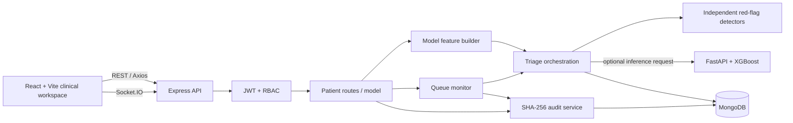

# PatientTriage.ai — System Architecture

PatientTriage.ai is a MERN-based emergency-department decision-support prototype with a separate Python/XGBoost inference boundary.

The architecture is deliberately layered so that the frontend presents information, the Node backend owns application and safety workflow, and the ML service provides model evidence without becoming the sole dependency for care workflow continuity.

## 1. High-level architecture



## 2. Layer responsibilities

### React frontend

The frontend contains:

```text
client/src/components/
  AlertCenter.jsx
  Badge.jsx
  Modal.jsx
  Sidebar.jsx
  TopBar.jsx

client/src/pages/
  Dashboard.jsx
  Intake.jsx
  Queue.jsx
  PatientDetail.jsx
  Audit.jsx
  Login.jsx
  Signup.jsx
```

The React client is responsible for:

- collecting operator input;
- displaying patient and model information;
- showing confidence and explanations;
- showing alerts and realtime state;
- capturing clinician accept/override actions;
- providing a responsive desktop/tablet/mobile interface.

It is **not** the authorization authority and it does not make an independent clinical decision.

### Node/Express backend

The backend is the application authority for:

- authentication;
- role-based authorization;
- patient persistence;
- dataset-aligned feature construction;
- triage orchestration;
- red-flag checks;
- confidence handling;
- queue monitoring;
- clinician actions;
- audit records;
- Socket.IO events.

### MongoDB

MongoDB stores:

- users;
- patients;
- assessments;
- triage outputs;
- queue state;
- audit events.

### Python/XGBoost service

The FastAPI inference service has one narrow purpose:

```text
feature vector
    ↓
scikit-learn preprocessing pipeline
    ↓
XGBoost classifier
    ↓
ESI probabilities + top class
```

It does not own authentication, clinician authorization, queue state or audit records.

## 3. Patient-intake data flow

```text
Operator enters intake information
              ↓
Frontend validates basic required fields
              ↓
Frontend derives UI-level calculated values
              ↓
POST /api/patients
              ↓
Server extracts complaint signals
              ↓
Server builds canonical modelFeatures
              ↓
Independent red-flag checks
              ↓
XGBoost inference when available
              ↓
Confidence + safety policy
              ↓
ESI recommendation
              ↓
Persist patient + assessment
              ↓
Audit + realtime events
```

## 4. Dataset contract

The reference `train.csv` contains 40 columns. The model excludes:

```text
patient_id
```

because it is an identifier, plus:

```text
disposition
ed_los_hours
```

because they represent downstream outcomes, and:

```text
triage_acuity
```

because it is the target.

The remaining 36 features form the inference contract.

The frontend intake page captures the relevant feature families and the model feature builder canonicalizes them before inference.

## 5. Feature engineering

The application derives values such as:

```text
age_group
arrival_hour
arrival_day
arrival_month
arrival_season
shift
mean_arterial_pressure
pulse_pressure
bmi
shock_index
```

The operator should not have to manually compute these values.

## 6. Triage orchestration

The triage service follows this order:

1. Validate age and basic patient input.
2. Determine age band.
3. Extract or reuse clinical complaint signals.
4. Build the model feature vector.
5. Calculate independent red-flag results.
6. Calculate data completeness.
7. Run the XGBoost request when the inference service is available.
8. Use the deterministic prototype scorer as the fallback when inference is unavailable.
9. Combine model evidence and confidence factors.
10. Apply safety overrides.
11. Produce ESI, confidence, action, reasons and feature evidence.
12. Store the result with the assessment history.

## 7. Safety policy

The model result does not directly become the final clinical action.

```text
                    ┌──────────────────┐
                    │ XGBoost evidence │
                    └────────┬─────────┘
                             ↓
                 ┌─────────────────────┐
                 │ Independent safety  │
                 │ red-flag detectors  │
                 └─────────┬───────────┘
                           ↓
                 ┌─────────────────────┐
                 │ Confidence / data   │
                 │ completeness policy │
                 └─────────┬───────────┘
                           ↓
                 ┌─────────────────────┐
                 │ Recommendation state│
                 └─────────────────────┘
```

Possible action states are:

```text
AUTO_CONTEXT
IMMEDIATE_ESCALATION
ABSTAIN_AND_ESCALATE
FAIL_OPEN
```

### Immediate escalation

A positive prototype red-flag detector can force higher urgency and immediate escalation.

### Abstain and escalate

When confidence or completeness is sufficiently low, the application does not silently assume lower acuity. It explicitly moves into an escalation path.

### Fail-open

When XGBoost inference is unavailable, the Node scorer falls back to its deterministic prototype path. This keeps the application usable while exposing the model source for traceability.

## 8. Confidence model

The prototype confidence calculation combines:

```text
data completeness
signal consistency
history availability
age normalization
model/safety agreement
```

The weighting is centralized in `CONFIDENCE_WEIGHTS` so it can be calibrated later instead of being scattered through route handlers.

## 9. Red-flag architecture

The current prototype contains independent detectors for:

```text
Sepsis-like presentation
MI-like presentation
Stroke-like presentation
Respiratory-failure-like presentation
```

The detectors produce a positive state, a bounded score and reason strings.

These results are preserved in the patient assessment so the UI can explain why a safety state changed.

## 10. Continuous queue monitoring

The queue monitor periodically loads waiting patients and checks whether reassessment is due.

For a due patient it:

```text
re-score
   ↓
compare with previous ESI
   ↓
detect deterioration
   ↓
update next reassessment time
   ↓
write audit events
   ↓
emit realtime events
   ↓
reorder queue
```

Prototype wait windows are configured centrally:

```text
ESI 1 → 5 minutes
ESI 2 → 15 minutes
ESI 3 → 30 minutes
ESI 4 → 60 minutes
ESI 5 → 90 minutes
```

These are software-demo assumptions, not clinical guidelines.

## 11. Surge behavior

Surge mode shortens the reassessment cadence so the demonstration can model increased operational pressure and more frequent patient review.

The setting is visible from the Live Queue page and changes the next reassessment interval stored with the patient.

## 12. Realtime alert architecture

The backend emits Socket.IO events for significant operational changes.

The frontend alert center consumes events including:

```text
triage:completed
escalation
deterioration
override
reassessment
surge:completed
```

Alerts can also be populated from recent audit history when the application opens.

## 13. Clinician workflow

The clinician reviews:

```text
ESI recommendation
Confidence
Age band
Data completeness
History availability
Safety flags
Reasons
Feature contributions
```

The clinician can then:

```text
Accept
Override
Reassess
```

The acceptance/override action is stored separately from the model output.

## 14. Audit architecture

The audit service creates a linked chain:

```text
Event A
  hash = H(A + GENESIS)
       ↓
Event B
  hash = H(B + hash(A))
       ↓
Event C
  hash = H(C + hash(B))
```

Verification recomputes the expected hash values and checks the `previousHash` relationship for each event.

The audit collection is intended for prototype traceability. Production deployments need stronger immutable logging and access-control guarantees.

## 15. Authentication architecture

```text
Login / Signup
      ↓
Express auth route
      ↓
bcrypt password verification / hashing
      ↓
JWT issued
      ↓
Authorization header on protected requests
      ↓
Server-side RBAC middleware
```

The frontend uses local storage for the demo session. Production authentication should be hardened to match deployment requirements.

## 16. Failure boundaries

The application is designed so one subsystem does not unnecessarily stop the complete workflow.

```text
MongoDB unavailable
    → startup fails because persistence is required

XGBoost unavailable
    → Node uses deterministic fallback

Realtime unavailable
    → core REST workflow remains available

Client not authenticated
    → protected routes are denied by backend
```

This distinction is useful during both development and demonstrations.

## 17. Production evolution

A production architecture could add:

```text
Reverse proxy / API gateway
       ↓
Authenticated Node API
       ↓
Internal inference service
       ↓
Model registry + versioned artifacts
       ↓
Observability + drift monitoring
       ↓
Secure database / audit infrastructure
```

The frontend contract does not need to change simply because the model implementation changes.

## 18. Prototype boundaries

The current implementation is a technical demonstration using synthetic data. The prototype thresholds, red-flag logic, confidence policy and trained model need clinical validation and formal governance before real-world use.
