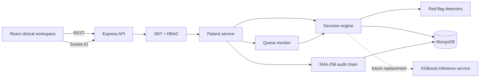

# PatientTriage.ai — Architecture

PatientTriage.ai is organized as a MERN application with a stable decision-support contract. The frontend never decides authorization or final clinical priority; it presents model output and records clinician action.

## System architecture

## Request and triage flow

1. The clinician signs in and receives a JWT.
2. Protected routes are authorized by role on the server.
3. Patient Intake captures the clinical and contextual features represented in the reference training dataset.
4. The backend generates the synthetic patient identifier and extracts complaint signals.
5. The decision engine applies age-aware prototype thresholds, severity scoring, red-flag detectors and confidence calculation.
6. A red flag short-circuits the general ranking and causes immediate escalation.
7. Low confidence or sparse/conflicting data uses the explicit `ABSTAIN_AND_ESCALATE` path.
8. Engine failure uses `FAIL_OPEN` so manual triage remains available.
9. The recommendation and reasons are stored with the patient and assessment history.
10. Clinician accept/override is stored separately from the model recommendation.

## Training data contract

The reference `train.csv` contains 40 columns. Four columns are intentionally excluded from model input:

- `patient_id` — unique identifier.
- `disposition` — downstream outcome after triage.
- `ed_los_hours` — downstream outcome that can leak post-triage information.
- `triage_acuity` — target.

The remaining columns are represented by the intake `modelFeatures` object using the same dataset field names. Time fields and arithmetic features are calculated where appropriate rather than asking the operator to duplicate calculations.

## Age-aware logic

Age groups are derived before scoring:

- Pediatric
- Adolescent
- Adult
- Geriatric

Prototype vital ranges are kept in one configuration object so they can be calibrated later instead of being scattered through route handlers. These values are demonstration assumptions, not clinical guidance.

## Confidence and uncertainty

Confidence is deterministic and combines data completeness, signal consistency, history availability, age normalization and agreement between scoring layers. Zero-history patients explicitly lose confidence. When confidence is low, the system does not silently choose a lower-risk interpretation.

## Queue monitoring

Waiting patients have a `safeMaxWaitMinutes`, reassessment timestamps and queue status. The queue monitor re-evaluates waiting patients and can tighten the cadence during surge mode.

## Audit chain

Clinical decision events are appended to a SHA-256 linked chain. The record contains the event type, patient, actor, role, timestamp, payload, previous hash and current hash. The Audit page provides chain verification.

## Production XGBoost boundary

The repository contains a reproducible XGBoost training pipeline under `ml/`. The MERN runtime currently uses the local prototype scorer for reliability and easy setup. The service boundary is intentionally stable so an internal XGBoost/SHAP inference service can replace the scorer later without changing the React workflow.

## Safety and governance

The interface presents recommendations, confidence and reasoning and always preserves clinician accept/override authority. Overrides require a structured reason and are audited. Production deployment would require clinical validation, secure handling of sensitive data, model monitoring and formal governance.
