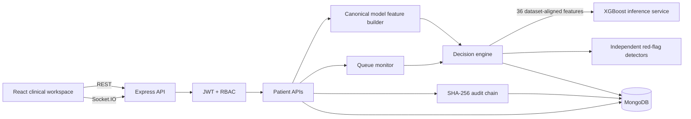

# PatientTriage.ai — Architecture

PatientTriage.ai is a MERN clinical decision-support application with a narrow ML inference boundary. The browser is responsible for presentation and data capture; the backend owns authorization, feature construction, safety logic and clinician actions.

## System architecture



## Request and triage flow

1. The clinician signs in and receives a JWT.
2. Protected routes are authorized by role on the server.
3. Patient Intake captures the clinical and operational values represented in the reference training dataset.
4. The backend generates the synthetic patient identifier and extracts complaint signals.
5. `buildModelFeatures()` creates the canonical 36-column model input using the same feature names used during XGBoost training.
6. `scorePatient()` first evaluates the independent safety layer and then requests an XGBoost prediction from the local inference service.
7. The model returns an ESI class and class probabilities.
8. A positive red flag always short-circuits the normal ranking and causes immediate escalation.
9. Low confidence or sparse/conflicting data uses the explicit `ABSTAIN_AND_ESCALATE` path.
10. If the model service is unavailable, the deterministic prototype scorer is used as a visible fallback; a complete engine failure uses `FAIL_OPEN` for manual triage.
11. The recommendation, model source, probabilities and reasons are stored with the patient and assessment history.
12. Clinician accept/override remains separate from the model recommendation.

## Training data contract

The reference `train.csv` contains 40 columns. Four columns are intentionally excluded from model input:

- `patient_id` — unique identifier.
- `disposition` — post-triage outcome.
- `ed_los_hours` — post-triage outcome that can leak future information.
- `triage_acuity` — target.

The remaining 36 columns are the model contract. The React form and server-side feature builder use those exact names. Derived fields such as age group, arrival context, BMI, mean arterial pressure, pulse pressure and shock index are calculated before inference.

The Python inference service uses the persisted scikit-learn preprocessing pipeline from training, keeping imputation and one-hot encoding coupled to the trained XGBoost model.

## Age-aware logic

Age groups are derived as:

- Pediatric
- Adolescent
- Adult
- Geriatric

Prototype vital ranges are centralized in `triageEngine.js` rather than scattered through route handlers. These are demonstration assumptions and are not clinical guidance.

## Confidence and uncertainty

Displayed confidence combines data completeness, model confidence, history availability, age normalization and red-flag agreement. Zero-history patients explicitly receive lower confidence. When uncertainty is high, the system favors escalation instead of silently selecting the lower-risk interpretation.

## Queue monitoring

Waiting patients carry a maximum wait window, reassessment timestamps and queue status. The queue monitor calls the same `scorePatient()` contract used for new arrivals, so scheduled reassessment can use XGBoost when the inference service is available. Surge mode shortens the interval.

## Audit chain

Clinical decision events are appended to a SHA-256 linked chain. Each event contains the event type, patient, actor, role, timestamp, payload, previous hash and current hash. The UI provides chain verification and human-readable event history.

## XGBoost service

The inference boundary is intentionally small:

```text
Node scorePatient()
       ↓
POST /predict
       ↓
FastAPI inference_service.py
       ↓
scikit-learn preprocessing pipeline
       ↓
XGBoost multiclass model
       ↓
ESI + probabilities + model confidence
```

The model artifact is generated locally from the supplied training data and is ignored by Git. This keeps the repository lightweight while allowing every developer to reproduce the same inference artifact.

## Safety and governance

The application presents recommendation, confidence, evidence and model source and preserves clinician authority to accept, override or use manual triage. Overrides require a structured reason and are audited. Production deployment would require clinical validation, secure data handling, model monitoring, version governance, interoperability and formal regulatory review.
