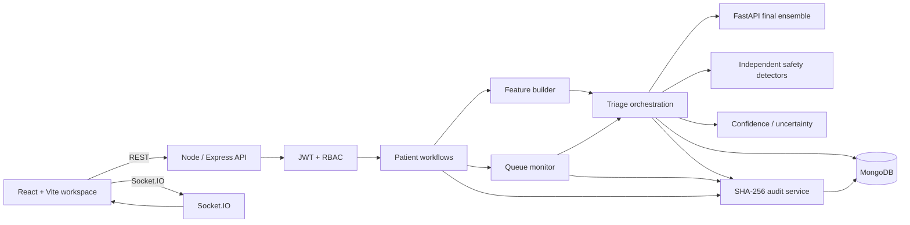

# PatientTriage.ai — System Architecture

## 1. Purpose

PatientTriage.ai is a full-stack emergency-department decision-support prototype. The codebase keeps the browser, application API, model runtime, safety logic, persistence and audit trail as separate concerns so each part can be tested and maintained independently.

The central product rule is:

```text
AI recommendation ≠ final clinical decision
```

The model supports the clinician. The clinician remains responsible for the final decision.

## 2. High-level architecture



## 3. Runtime responsibilities

### React frontend

The frontend handles presentation and browser-side workflow state:

- Command Centre metrics;
- dataset-aligned Patient Intake;
- Patient Review;
- Live Queue;
- Past Patients;
- Audit Trail;
- authentication screens;
- alert center and realtime status;
- clinician Accept, Override and Reassess interactions.

The browser is not the authorization boundary. It never decides whether a user is allowed to perform a protected operation.

### Node / Express backend

Node is the application and safety orchestration boundary. It owns:

- authentication and role checks;
- patient lifecycle;
- application-ID lookup;
- dataset feature construction;
- model invocation;
- independent safety detectors;
- confidence and uncertainty handling;
- queue monitoring;
- clinician decisions;
- audit writes;
- realtime event publication;
- model fallback handling.

### MongoDB

MongoDB persists:

```text
users
patients
AuditLog
```

A patient record keeps both clinician-facing values and the dataset-aligned model feature payload so that the exact inputs used for an assessment can be reviewed later.

### Python inference service

The FastAPI process has one narrow responsibility: load the supplied model artifact, prepare the expected feature frame and return the ensemble result.

The final artifact is:

```text
ml/artifacts/triage_ensemble_model.pkl
```

Its ensemble structure is:

```text
5 × LightGBM
+
5 × XGBoost
      ↓
LogisticRegression stacking model
      ↓
ESI 1–5 + probabilities + confidence
```

The FastAPI service does not own authentication, queue ordering, clinician actions or safety policy.

## 4. Patient creation flow

```text
Patient Intake
      ↓
POST /api/patients
      ↓
Validate clinician-entered fields
      ↓
Generate PT-YYYY-XXXXXX application ID
      ↓
Build dataset-aligned raw features
      ↓
Create final engineered feature vector
      ↓
Call supplied ensemble
      │
      ├── success → ensemble ESI/probabilities
      │
      └── unavailable → explicit deterministic fallback
      ↓
Run independent safety detectors
      ↓
Calculate confidence / completeness
      ↓
Apply safety precedence
      ↓
Persist patient + assessment
      ↓
Write audit event
      ↓
Emit realtime events
      ↓
Open Patient Review
```

## 5. Dataset and inference contract

The reference training dataset contains 40 columns. The application mirrors the clinician-relevant fields and keeps downstream outcomes separate from inference.

```text
patient_id     → identifier
triage_acuity  → target
 disposition   → downstream outcome
 ed_los_hours  → downstream outcome
```

The final artifact expands the raw clinical/context fields into a **52-column prediction feature set**. The runtime reads the canonical feature order stored inside the artifact rather than maintaining an independent competing order.

The feature builder is responsible for derived values such as:

```text
age_group
arrival_hour
arrival_day
arrival_month
arrival_season
shift
bmi
mean_arterial_pressure
pulse_pressure
shock_index
```

Additional engineered variables required by the supplied artifact are produced in the model runtime, including vital-deviation and red-flag features.

Post-triage outcomes are never fed back into prediction.

## 6. Final model path

```text
Raw patient data
       ↓
Artifact-aligned feature engineering
       ↓
Saved categorical mappings + saved feature order
       ↓
5 LightGBM fold probabilities
       +
5 XGBoost fold probabilities
       ↓
LogisticRegression meta-model
       ↓
Predicted ESI 1–5
       ↓
Five-class probability distribution
       ↓
Model confidence
```

The application records model source and version so clinicians can tell a supplied-model result from a fallback result.

## 7. Independent safety layer

The general model prediction is only one input to the application recommendation.

The Node layer evaluates independent prototype detector families:

```text
sepsis-like
MI-like
stroke-like
respiratory-failure-like
```

A configured positive safety detector can force an immediate-escalation action even when the general model predicts a less urgent class.

## 8. Uncertainty handling

The confidence layer considers data completeness and supporting evidence. Missing history is not silently treated as proof that the patient has no prior history.

When information is sparse or conflicting, the workflow can use:

```text
ABSTAIN_AND_ESCALATE
```

The purpose is to make uncertainty visible rather than hide it behind a confident-looking label.

## 9. Fail-open behavior

The Python model service is not allowed to become a single point of failure for the prototype.

```text
FastAPI inference
      ↓
request / timeout / artifact error
      ↓
Node catches the failure
      ↓
deterministic prototype scorer
      ↓
model source recorded as fallback
      ↓
workflow remains available
```

The UI must never label fallback output as the supplied final ensemble.

## 10. Human-in-the-loop state

The patient record keeps separate values for recommendation and final decision:

```text
triage.esi  → model recommendation
manualEsi   → clinician-selected value
finalEsi    → effective final priority
```

The available actions are:

```text
Accept
Override
Reassess
Mark service done
```

Override requires a target ESI and structured reason, and the action is audited.

## 11. Reassessment history

Reassessment creates a new assessment entry instead of overwriting the past record.

The Patient Review page exposes the retained history so clinicians can see:

```text
previous recommendation
new recommendation
confidence
model source
reason / supporting signals
timestamp
```

For long histories, the UI uses an internal scroll region instead of allowing the entire page to grow without bound.

## 12. Patient completion and Past Patients

When the operational service is completed:

```text
active patient
      ↓
Mark service done
      ↓
status updated
      ↓
removed from active workflow
      ↓
available in Past Patients
```

Historical data remains available for review and audit.

## 13. Queue monitoring

Waiting patients retain queue state such as:

```text
queueStatus
position
finalEsi
safeMaxWaitMinutes
lastReassessmentAt
nextReassessmentAt
surgeMode
deteriorationDetected
```

The queue monitor reuses the same triage orchestration as patient arrival so reassessment does not become a separate scoring path.

## 14. Realtime alerts

Socket.IO provides live operational events:

```text
system:health
patient:created
triage:completed
escalation
reassessment
override
queue:updated
```

The Alert Center converts these into unread notifications and critical/warning toast states. The alert menu is intentionally bounded and scrollable so a large number of alerts does not cover the entire page.

## 15. Audit architecture

Important events are written to `AuditLog` with linked hashes:

```text
eventId
eventType
patientId
actorId
actorRole
timestamp
payload
previousHash
hash
```

The current hash includes the canonical event data and the preceding hash. Verification walks the chain and identifies the first mismatch.

This is an application-level integrity mechanism for the prototype, not a certified immutable compliance system.

## 16. Authentication and authorization

```text
Login / Signup
      ↓
bcrypt password hashing / verification
      ↓
JWT
      ↓
Axios Bearer token
      ↓
Express auth middleware
      ↓
server-side role check
```

Supported roles are:

```text
triage_nurse
charge_nurse
clinical_admin
system_admin
```

The browser does not grant roles or privileges.

## 17. Responsive architecture

The UI adapts the information density rather than simply shrinking the desktop layout.

```text
Desktop       multi-column operations workspace
Tablet        fewer columns / tighter spacing
Phone         stacked content / reachable actions
Small phone   single-column forms / local table scrolling
```

The alert panel, reassessment history and data tables use local scroll areas where appropriate to prevent page-wide overflow.

## 18. Code organization

```text
client/src/components/ → reusable UI pieces
client/src/pages/      → route-level workflows
client/src/utils/      → shared transformations/helpers
server/src/routes/     → HTTP boundary
server/src/services/   → feature construction + triage logic
server/src/models/     → MongoDB schemas
ml/                    → final model runtime and verification
```

Keep comments focused on intent. A useful comment answers “why is this necessary?” rather than restating what the next line already says.

## 19. Production evolution

A production architecture would still need:

- managed secrets and TLS;
- centralized identity;
- stronger database controls;
- durable event infrastructure;
- structured observability;
- model registry/version management;
- calibration and subgroup monitoring;
- formal clinical validation;
- disaster recovery;
- immutable compliance-grade audit infrastructure;
- privacy and regulatory review.

The present topology is intentionally small enough for local demonstration and development.
