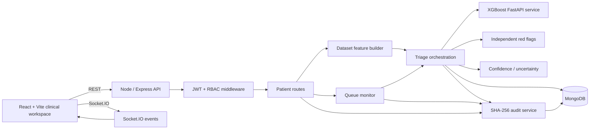

# PatientTriage.ai — System Architecture

## 1. Purpose

PatientTriage.ai is a full-stack emergency-department decision-support prototype. The architecture separates the presentation layer, application orchestration, model inference, safety logic, persistence and auditability so each responsibility can be changed without turning the application into one large block of code.

The most important boundary is:

```text
AI recommendation ≠ final clinical decision
```

The clinician remains responsible for accepting, modifying or replacing the recommendation.

## 2. High-level architecture



## 3. Runtime components

### Frontend

The React application is responsible for:

- rendering the Command Centre;
- collecting patient intake data;
- displaying model results and confidence;
- displaying independent red-flag results;
- recording explicit clinician actions;
- rendering the queue and alert center;
- displaying the audit trail;
- handling browser-side routing and session state.

The frontend is intentionally not an authorization boundary. API permissions are enforced by the backend.

### Node / Express backend

The Node process is the application coordinator. It owns:

- authentication and role checks;
- patient creation and retrieval;
- feature-vector construction;
- triage orchestration;
- safety decisions;
- queue monitoring;
- alert event publication;
- clinician acceptance/override handling;
- audit writes;
- database access.

This allows the application to continue operating even when the Python model service is unavailable.

### MongoDB

MongoDB stores the operational state:

```text
users
patients
AuditLog
```

Patient records contain both the clinician-facing representation and the dataset-aligned `modelFeatures` object used for inference traceability.

### Python inference service

`ml/inference_service.py` is intentionally small. It does only three things:

1. load the persisted XGBoost pipeline;
2. validate that the required feature names are present;
3. return the predicted ESI class and class probabilities.

The Python service does not own authentication, clinician decisions, queue ordering, audit logging or safety policy.

## 4. Patient creation flow

```text
POST /api/patients
        ↓
Validate required clinician inputs
        ↓
Generate PT-YYYY-XXXXXX patient ID
        ↓
Extract complaint signals
        ↓
Build dataset-aligned modelFeatures
        ↓
Run triage orchestration
        ↓
Try XGBoost inference
        │
        ├── available → use model probabilities
        │
        └── unavailable → deterministic fallback scorer
        ↓
Run independent red-flag checks
        ↓
Calculate confidence / completeness
        ↓
Apply safety precedence rules
        ↓
Persist recommendation + assessment
        ↓
Append audit events
        ↓
Emit realtime Socket.IO events
        ↓
Return patient record
```

## 5. Dataset feature contract

The reference dataset contains 40 columns. Four are excluded from prediction:

| Field | Treatment |
|---|---|
| `patient_id` | generated application identifier, not a predictor |
| `disposition` | excluded because it is downstream of triage |
| `ed_los_hours` | excluded because it is downstream and can leak outcome information |
| `triage_acuity` | target label |

The remaining 36 fields are the model inputs.

The browser does not ask staff to calculate derived values manually. The intake layer derives fields such as age group, arrival timing context, BMI, mean arterial pressure, pulse pressure and shock index.

## 6. Triage orchestration

Triage consists of multiple layers rather than one score.

### Layer 1 — model evidence

XGBoost returns:

```text
predicted ESI
ESI 1 probability
ESI 2 probability
ESI 3 probability
ESI 4 probability
ESI 5 probability
model confidence
model version
```

### Layer 2 — independent safety detectors

The application evaluates separate detector families:

```text
sepsis-like
MI-like
stroke-like
respiratory-failure-like
```

The detectors produce a structured state with a score, positive/clear state and reasons.

### Layer 3 — uncertainty

Confidence considers:

- data completeness;
- model/signal agreement;
- history availability;
- age normalization;
- supporting evidence.

A patient without prior history is deliberately treated as less certain rather than being silently assumed to have no history.

### Layer 4 — safety precedence

The general prediction never overrides a positive high-sensitivity safety condition.

Conceptually:

```text
red flag positive
      ↓
IMMEDIATE_ESCALATION

otherwise low confidence / sparse data
      ↓
ABSTAIN_AND_ESCALATE

otherwise
      ↓
AUTO_CONTEXT
```

## 7. Fail-open behavior

The model service is optional at runtime because reliability is more important than forcing a dependency on a separate Python process.

When inference fails:

```text
XGBoost request
     ↓
connection / timeout / service error
     ↓
deterministic prototype scorer
     ↓
modelSource = fallback/prototype
     ↓
workflow continues
```

The fallback is explicit and traceable; it is not presented as a successful XGBoost inference.

## 8. Human-in-the-loop boundary

The model recommendation is stored separately from the final clinician choice.

Examples:

```text
triage.esi       → model recommendation
manualEsi        → clinician selected value
finalEsi         → effective final priority
```

An override requires a target ESI and structured reason. The action is audited.

## 9. Continuous queue monitoring

Waiting patients maintain:

```text
queueStatus
position
finalEsi
safeMaxWaitMinutes
lastReassessmentAt
nextReassessmentAt
surgeMode
deteriorationDetected
```

The queue monitor selects due patients, re-runs the same triage orchestration used at arrival, updates the queue and emits a realtime event.

Surge mode shortens the prototype reassessment cadence.

## 10. Realtime event architecture

Socket.IO is shared by the main React shell so individual pages do not create duplicate connections.

Important events include:

```text
system:health
patient:created
triage:completed
escalation
reassessment
override
queue:updated
```

The alert center converts safety-relevant events into visible in-app notifications.

## 11. Audit architecture

Every important decision event is appended to the audit collection.

Each record contains:

```text
eventId
eventType
patientId
actorId
actorRole
timestamp
payload
previousHash
hash
```

The hash is calculated over a canonical representation of the event and the preceding hash. Verification walks the chain in order and reports the first mismatch.

This is an application-level integrity mechanism for the prototype. It is not a replacement for a production immutable logging platform.

## 12. Authentication and authorization

The authentication flow is:

```text
Login / Signup
      ↓
bcrypt password verification / hashing
      ↓
JWT creation
      ↓
Browser stores session token
      ↓
Axios attaches Bearer token
      ↓
Express auth middleware validates token
      ↓
Role middleware checks operation privilege
```

The signup endpoint never trusts a browser-supplied privileged role.

## 13. Frontend structure

The client separates reusable components from workflow pages:

```text
components/
  AlertCenter
  Badge
  Modal
  Sidebar
  TopBar

pages/
  Login
  Signup
  Dashboard
  Intake
  Queue
  PatientDetail
  Audit
```

`responsive.css` contains viewport-specific behavior instead of mixing every mobile rule into each page component.

## 14. Responsive architecture

The UI is desktop-first but adapts its information density:

```text
Desktop      dense multi-column workspace
Tablet       reduced columns + narrower navigation
Phone        mobile navigation + stacked content
Small phone  single-column controls
```

Data-heavy tables use their own horizontal scrolling region where necessary. The page itself is not intentionally widened beyond the viewport.

## 15. Security boundary

Security controls are distributed as follows:

```text
Browser
  → presentation/session only

Express
  → authentication
  → authorization
  → validation
  → rate limiting
  → safety decisions

MongoDB
  → persistent application state

Audit service
  → integrity-linked decision events
```

See `docs/SECURITY.md` for detailed production gaps.

## 16. Production evolution

A production architecture would normally add:

- managed secret storage;
- TLS everywhere;
- centralized identity management;
- stronger database authorization;
- durable message/event infrastructure;
- observability and alerting;
- model registry/version management;
- calibration and bias monitoring;
- formal clinical validation;
- disaster recovery and backup policies;
- immutable compliance-grade audit infrastructure.

The current prototype deliberately keeps the topology small enough to run locally.
